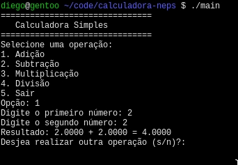

# Calculadora de CLI
Realiza operações aritimeticas simples entre dois operandos, projeto feito para
curso da Neps Academy



# Instalação e pré-requisitos
No momento da instalação, é necessario ter instalado:
* `Make` (o programa é testado apenas com o GNU make)
* Um compilador de C, o Make ira usar `cc`, o padrão do seu sistema
* Recomenda-se que instale o codigo com o `git`, mas ele também pode ser baixado pelo github

### Clone o repositorio
```bash
$ git clone git@github.com:foo8664/calculadora-neps.git
(...)
$ git clone https://github.com/foo8664/calculadora-neps.git # Também é possivel
```

### Compile o codigo
```bash
$ cd calculadora-neps
$ make
(...)
```

# Como usar
execute o programa no terminal: `./main`, e siga as instruções providenciadas
pelo programa:
```bash
$ ./main
===============================
   Calculadora Simples
===============================
Selecione uma operação:
1. Adição
2. Subtração
3. Multiplicação
4. Divisão
5. Sair
Opção: 3
Digite o primeiro número: 3
Digite o segundo número: 3
Resultado: 3.0000 * 3.0000 = 9.0000
Desjea realizar outra operação (s/n)?: n
*(clear)*
Obrigado por usar a calculadora! Até a próxima.
$
```

# Estrutura do projeto
```bash

.
├── Makefile    # Receita para o make
├── README.md   # Arquivo que você esta lendo
└── main.c      # codigo do programa
```

# Licensa
[MIT](LICENSE.md)
